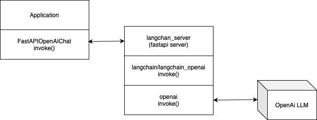

# LangChain OpenAI API Wrapper

This is proof-of-concept of a FastAPI server that wraps the `langchain` OpenAI chat completion API.  This prototype demonstrates creating a proxy wrapper for `langchain` in a server separate from the client applicaiton. 



## Features

- Redis-backed conversation history storage
- Reusable model configurations
- Stateful chat completions with conversation IDs
- Token usage tracking
- LangChain integration
- Multiple test client implementations

## Setup

1. Make sure you have all the required dependencies installed:
   ```
   pip install -r requirements.txt
   ```

2. Set your OpenAI API key as an environment variable:
   ```
   export OPENAI_API_KEY="your_openai_api_key"
   ```

3. Redis Configuration (optional):
   ```
   export REDIS_HOST="your_redis_host"      # defaults to localhost
   export REDIS_PORT="your_redis_port"      # defaults to 6379
   export REDIS_DB="your_redis_db"          # defaults to 0
   export REDIS_PASSWORD="your_redis_password" # optional
   export CONVERSATION_TTL="3600"           # conversation expiration in seconds (default: 1 hour)
   ```

## Running the Server

To start the server, run:

In one terminal, start the Redis server (if not already running):
```bash
# start Redis server (if not already running)
/opt/homebrew/bin/redis-server 
```

In another terminal, start the FastAPI server:
```bash
cd ~/Desktop/genai/langchain_wrapper
python src/wrapper/langchain_server.py
```

The server will be available at `http://localhost:8000`.

## Testing the API

This project includes multiple test clients to interact with the API:

### Simple Test Client (test_redis_client.py)

A command-line client that provides basic functionality to interact with the server:

```bash
# Make a chat request
python src/wrapper/test_redis_client.py --action chat --prompt "What is the capital of Hawaii?"

# Continue the conversation with the same conversation ID
python src/wrapper/test_redis_client.py --action chat --prompt "Tell me more about it" --conversation_id "your-conversation-id"

# Use a specific model ID
python src/wrapper/test_redis_client.py --action chat --prompt "How does AI work?" --model_id "your-model-id"

# List all conversations
python src/wrapper/test_redis_client.py --action list-conversations

# Get a specific conversation
python src/wrapper/test_redis_client.py --action get --conversation_id "your-conversation-id"

# Delete a conversation
python src/wrapper/test_redis_client.py --action delete --conversation_id "your-conversation-id"
```

### LangChain Compatible Client (test_client.py)

A client that mimics the LangChain OpenAI chat completion class, allowing for more integration with other LangChain components:

```python
from src.wrapper.fastapi_chat import FastAPIChatOpenAI, SystemMessage, HumanMessage

# Initialize the client (creates a model configuration in Redis)
chat = FastAPIChatOpenAI(
    base_url="http://localhost:8000",
    model="gpt-4o-mini",
    temperature=0.7
)

# Create messages in LangChain format
messages = [
    SystemMessage(content="You are a helpful assistant."),
    HumanMessage(content="What is the capital of Hawaii?")
]

# Get a response
response = chat.invoke(messages)
print(response.content)

# Continue the conversation (uses the stored conversation ID)
follow_up = [HumanMessage(content="Tell me more about it")]
response2 = chat.invoke(follow_up)
print(response2.content)

# Get conversation history
history = chat.get_conversation_history()
print(history)

# List all conversations
conversations = chat.list_conversations()
print(conversations)

# Delete a conversation
chat.delete_conversation()
```

### Baseline Testbed (testbed_baseline.py)

A simple script to test direct interaction with the OpenAI API via LangChain (without the FastAPI wrapper):

```bash
python src/wrapper/baseline_testbed.py
```

A simple script to test `langchain` wrapper to OpenAI API via LangChain (via the FastAPI server):

```bash
export PYTHONPATH=$PWD:$PYTHONPATH
python src/wrapper/baseline_custom.py
```

## API Endpoints

### Chat Completions

#### POST /v1/chat/completions

This endpoint accepts chat completion requests and returns the generated response using LangChain's OpenAI integration.

```json
{
  "messages": [
    {
      "role": "system",
      "content": "You are a helpful assistant."
    },
    {
      "role": "user",
      "content": "What is the capital of Hawaii?"
    }
  ],
  "model": "gpt-3.5-turbo",
  "temperature": 0.7,
  "max_tokens": null,
  "conversation_id": "optional-conversation-id",
  "model_id": "optional-model-id"
}
```

The response includes a conversation ID that can be used to continue the conversation:

```json
{
  "content": "The capital of Hawaii is Honolulu, located on the island of Oahu.",
  "conversation_id": "conversation-uuid",
  "usage": {
    "prompt_tokens": 28,
    "completion_tokens": 15,
    "total_tokens": 43
  },
  "additional_kwargs": {}
}
```

### Conversations

#### GET /v1/conversations/{conversation_id}

Retrieve a specific conversation history.

#### GET /v1/conversations

List all conversation IDs.

#### DELETE /v1/conversations/{conversation_id}

Delete a specific conversation.

### Health Check

#### GET /health

Health check endpoint that returns the status of the API.

## Interactive API Documentation

FastAPI automatically generates interactive API documentation. After starting the server, you can access:

- Swagger UI: http://localhost:8000/docs
- ReDoc: http://localhost:8000/redoc

## Project Structure

```
langchain_wrapper/
├── images/                # Diagrams for documentation
│   ├── baseline.drawio.png
│   └── custom.drawio.png
├── notebooks/             # Jupyter notebooks for demos
│   ├── demo.ipynb
│   └── README.md
├── requirements.txt       # Project dependencies
├── pyproject.toml         # Python project configuration
├── README.md              # This file
└── src/
    ├── fastapi/
    │   ├── client.py      # Basic FastAPI client example
    │   └── server.py      # Basic FastAPI server example
    └── wrapper/
        ├── fastapi_chat.py       # FastAPI Chat wrapper for LangChain
        ├── langchain_server.py   # Main FastAPI server with Redis
        ├── test_client.py        # LangChain-compatible client
        ├── test_redis_client.py  # CLI client for testing
        ├── testbed_baseline.py   # Baseline testbed for direct OpenAI testing
        └── testbed_custom.py     # Custom testbed for wrapper testing
```